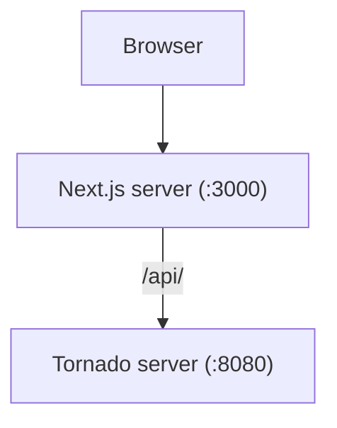
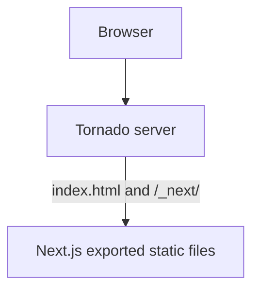

# app

## Request flow

### Local development

```mermaid
graph TD
    Next["Next.js server (:3000)"]
    Tornado["Tornado server (:8080)"]

    Browser --> Next
    Next -->|/api/| Tornado
```

### Production

```mermaid
graph TD
    Next["Next.js exported static files"]
    Tornado["Tornado server"]

    Browser --> Tornado
    Tornado -->|index.html and /_next/| Next
```
